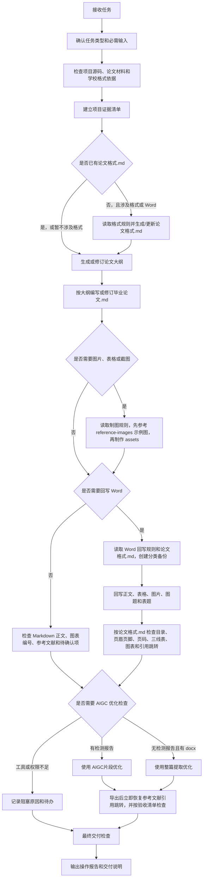

# Graduation Thesis Skill说明

本 Skill 用于根据真实软件项目编写本科毕业论文，适合“先在 Markdown 中写内容，再制作图表和截图，最后回写 Word 模板”的工作方式。

## 按需读取

- 本地环境、依赖工具和资料检查：读取 [`references_env/AI环境检查.md`](references_env/AI环境检查.md)。
- 图片、流程图、架构图、类图、E-R 图、时序图制作：读取 [`references_diagram/图片制作规则.md`](references_diagram/图片制作规则.md)，并必须先查看 `reference-images/` 中对应类型示例图。
- 查重报告、AIGC 检测报告、“降 AI”“降 AIGC”“降查重”，以及 Word 回写或最终交付前主动 AIGC 优化检查：读取 [`references_aigc/检测报告处理与降AIGC改写.md`](references_aigc/检测报告处理与降AIGC改写.md)；完成工具导出后读取 [`references_aigc/降AIGC验收清单.md`](references_aigc/降AIGC验收清单.md)。
- 示例论文、格式手册、工作手册、Word 模板分析：读取 [`references_format/格式分析与论文格式.md`](references_format/格式分析与论文格式.md)。
- Word 回写、格式修改、分类备份、手改稿保护、最终交付检查：读取 [`references_word/Word回写与交付检查.md`](references_word/Word回写与交付检查.md)。

## 目录职责

- `SKILL.md`：只放触发、导航、总规则和总流程。
- `references_env/`：环境和资料检查。
- `references_diagram/`：图片、图表、流程图、类图等制图规则。
- `reference-images/`：存放参考图片示例和简单目录索引，不存放制图规则文档。
- `references_aigc/`：查重报告、AIGC 报告、降重改写规则和降 AIGC 交付验收清单。
- `references_format/`：格式分析和 `论文格式.md` 生成规则。
- `references_word/`：Word 回写、分类备份、手改稿保护和交付检查。
- `skills/`：内置或随包携带的外部技能，如 drawio-skill、playwright。

# 总规则

1. 论文必须以真实项目为依据。写作前先看源码、开题报告、已有论文草稿和学校格式要求，不能凭空添加项目没有实现的功能。
2. 默认先写入 `毕业论文.md`，图片、流程图、类图、页面截图统一放入 `assets` 目录。只有用户明确要求时，才把内容回写到 Word。
3. 写正文时保持本科毕业论文口吻，语句正式、清楚、不过度夸张。不要把所有功能细节全部展开，重点写设计思路、核心流程和代表性功能。
4. 章节标题按用户给出的目录执行。若发现编号明显错误，可以顺手修正同一章内的小节编号。
5. 技术描述要保守。没有源码证据时，不写未使用内容。
6. 测试章节要贴近毕业设计演示和常规功能验证，不编造精确压测指标。可以写“通过”“运行正常”“满足基本使用需求”，避免无依据的毫秒级数据。
7. 图表命名要连续。删除某张图后，后续图号、文件名和 Markdown 引用必须同步前移，并检查所有图片路径存在。
8. 参考文献只写与正文相关的真实来源，优先使用期刊论文、会议论文、学位论文、专著、标准等正式文献；官方文档只在框架、接口、平台版本说明确实需要时补充。默认使用近三年资料，按年份口径取当前年份及前两年，若学校要求按日期计算，则从写作日期向前 36 个月内筛选。超出近三年的经典基础资料或官方长期文档必须有明确必要性。
9. 降 AIGC 或降查重时，不以同义词替换为主；先按检测报告定位热点，再围绕真实项目证据重组段落。不能承诺具体分数，不能为了降分编造事实。

# 必需输入

开始正式写作、回写或定稿前，应尽量确认以下输入。缺少某项时，不要硬编，先在报告或 `论文格式.md` 中标明待确认。

- 真实项目源码：后端、前端、移动端、数据库脚本、配置文件。
- 项目说明材料：开题报告、任务书、已有论文草稿、用户补充说明。
- 格式依据：学校格式手册、工作手册、Word 模板、示例论文。
- 检测材料：查重报告、AIGC 报告、标红页截图、报告导出文本或用户摘录结果。
- 写作文件：`毕业论文.md`、`论文大纲.md`、已有章节草稿。
- Word 文件：目标 `毕业设计说明书.docx`，以及用户指定的工作稿或手改稿。
- 资源目录：`assets/`、截图目录、drawio 源文件、页面截图。
- 输出与记录：`论文格式.md`、回写报告、`备份/` 分类目录。

# 不可违反规则

- 不覆盖用户原始文件或手改文件；除非用户明确指定当前文件就是工作稿。
- 不把目录页文字当作正文锚点；替换章节内容时必须定位正文真实标题。
- 不根据模板话术编造项目没有实现的功能、技术、测试数据或部署情况。
- 不把格式经验当作学校格式要求；具体格式必须来自用户提供的手册、模板、示例或 `论文格式.md`。
- 不在 Word 被占用时强行覆盖；应先生成修正版，等用户保存关闭后再替换。
- 不让过程说明、修订记录、待办文字进入正式论文正文。
- 不破坏自动目录、页码域、交叉引用、书签、超链接和用户手动调整的版面。
- 不整篇重写用户已经确认过的正文；只修改用户当前要求的范围。
- 不把检测报告当作事实来源；报告只决定修改优先级，论文事实仍以项目证据为准。

# 总流程

## 0. 运行流程图

执行本 Skill 时先按下图走一遍；用户只要求局部任务时，也要检查该任务的前置依据和后置验收是否需要补做。

## 1. 了解项目

先建立项目证据清单，再开始写论文。如果是第一次在当前电脑使用本 Skill，或后续需要 Word 回写、draw.io 制图、Playwright 截图、项目运行截图，先按 [`references_env/AI环境检查.md`](references_env/AI环境检查.md) 检查环境。

重点查看：

- 后端：`pom.xml`、`application.yml`、controller、service、dao、entity。
- 管理后台：`package.json`、router、request 封装、主要 Vue 页面。
- 移动端：`pages.json`、`main.js`、`App.vue`、各 `pages/*/*.vue` 页面。
- 数据库：SQL 文件、实体字段、实际表名。
- 文档：开题报告、学校格式要求、示例论文或工作手册。

需要记录：

- 技术栈、功能边界、接口路径、核心数据表。
- 源码没有出现的功能和不应写入论文的内容。
- AI 功能的真实接入方式，例如前端直连外部接口、后端转发接口，或仅页面展示。

## 2. 生成论文大纲

先判断论文类型，再参考对应示例论文目录，并结合项目真实模块生成大纲。大纲要有三级标题，但不要细到把所有页面功能都列出来。

纯软件论文参考结构：

- 第1章 绪论
  - 1.1 论文背景及意义
  - 1.2 国内外发展现状
  - 1.3 论文组织结构
  - 1.4 本章小结
- 第2章 关键技术介绍
  - 2.1 后端开发关键技术
  - 2.2 前端或移动端相关技术
  - 2.3 数据库与开发工具
  - 2.4 本章小结
- 第3章 系统需求分析
  - 3.1 `{系统名称}` 功能需求分析
  - 3.1.1 `{模块一}` 模块需求分析
  - 3.1.2 `{模块二}` 模块需求分析
  - 3.1.3 `{模块三}` 模块需求分析
  - 按项目核心模块依次展开，不把所有页面都列为三级标题。
  - 3.2 非功能性需求分析
  - 3.2.1 性能需求
  - 3.2.2 可靠性需求
  - 3.2.3 兼容性需求
  - 3.2.4 易用性需求
  - 3.3 本章小结
- 第4章 系统设计
  - 4.1 总体功能设计
  - 4.2 数据库设计
  - 4.2.1 数据逻辑设计
  - 4.2.2 数据库表设计
  - 4.3 服务端接口设计
  - 4.4 本章小结
- 第5章 系统详细设计
  - 5.1 `{模块一}` 模块详细设计
  - 5.1.1 类设计
  - 5.1.2 详细流程设计
  - 5.1.3 页面展示
  - 5.2 `{模块二}` 模块详细设计
  - 5.2.1 类设计
  - 5.2.2 详细流程设计
  - 5.2.3 页面展示
  - 按核心模块依次展开，每个模块固定三个三级标题。
  - 最后一节 本章小结，编号按实际模块数量顺延。
- 第6章 系统测试
  - 6.1 系统功能测试
  - 6.2 系统非功能性测试
  - 6.3 本章小结
- 结论、参考文献、致谢。

纯软件论文第5章“系统详细设计”中，每个核心功能模块固定写三个三级标题，顺序和命名为“类设计”“详细流程设计”“页面展示”。示例：`5.1.1 类设计`、`5.1.2 详细流程设计`、`5.1.3 页面展示`。不要给单个功能模块额外增加第四个三级标题；特殊说明合并进这三项或放到本章小结。

软硬件结合论文参考结构：

- 第1章 引言
  - 1.1 研究背景及意义
  - 1.2 国内外研究现状
  - 1.2.1 国外研究现状
  - 1.2.2 国内研究现状
  - 1.3 主要研究内容及技术路线
  - 1.3.1 主要研究内容
  - 1.3.2 技术路线
- 第2章 系统基础及方案设计
  - 2.1 `{系统名称}` 系统概述
  - 2.2 系统方案设计
  - 2.2.1 系统整体需求分析
  - 2.2.2 系统总体设计
  - 2.2.3 系统功能设计
  - 2.3 本章小结
- 第3章 硬件设计
  - 3.1 总体模块硬件设计
  - 3.2 `{功能模块一}` 硬件设计
  - 3.3 `{功能模块二}` 硬件设计
  - 3.4 `{功能模块三}` 硬件设计
  - 3.5 本章小结
- 第4章 软件设计/实现
  - 4.1 总体模块软件设计
  - 4.2 `{功能模块一}` 软件设计
  - 4.3 `{功能模块二}` 软件设计
  - 4.4 `{功能模块三}` 软件设计
  - 4.5 本章小结
- 第5章 系统性能验证
  - 5.1 核心算法或识别性能测试
  - 5.2 定位与控制测试
  - 5.3 实时性与稳定性测试
  - 5.4 本章小结
- 总结、参考文献、致谢。

生成正式 `论文大纲.md` 时，必须把 `{系统名称}`、`{模块一}`、`{功能模块一}` 等占位符替换为项目真实名称和真实模块名；不得把占位符、`按核心模块依次展开`、`最后一节` 等模板说明原样写入正式大纲。

软硬件结合论文必须保持第3章硬件设计和第4章软件设计/实现功能一一对应，且对应小节的功能名称必须相同。先确定同一组功能模块，再分别写硬件支撑和软件实现，章节顺序要一致，只允许“硬件设计”“软件设计/实现”等后缀不同。例如“图像采集模块硬件设计”对应“图像采集模块软件设计”，“定位通信模块硬件设计”对应“定位通信模块软件设计”，“运动控制模块硬件设计”对应“运动控制模块软件设计”。不要在硬件章写一个功能、软件章换成另一组功能，也不要把“定位通信模块”在软件章改写成“识别定位算法”等不同名称。

软硬件结合论文的大纲小节数量要收敛，第3章硬件设计和第4章软件设计/实现的二级小节均控制在5个以内（含本章小结）。如果功能点超过5个，先合并为感知采集、定位通信、数据处理、运动控制、交互管理等上位模块，再保持硬件章和软件章逐项对应。

类型选择规则：

- 只有 Web、移动端、小程序、管理系统、AI 应用等软件实现时，优先按纯软件结构组织。
- 涉及传感器、嵌入式板卡、无人机、小车、机械结构、电路、驱动、控制算法或实物测试时，优先按软硬件结合结构组织。
- 如果项目同时有管理后台和硬件设备，后台管理内容放在软件设计或系统方案中，不要挤占硬件设计章节。

大纲写入 `论文大纲.md`。如果用户觉得太详细，减少功能枚举；如果用户觉得太简洁，保留三级标题但合并过细小节。

## 3. 编写正文

正文编写以 `毕业论文.md` 为主文件。每次写一个明确章节或小节，不一次性大范围乱改。

写作原则：

- 每节先写一段概述，再结合项目说明实现方式。
- 需要图表时，正文先引出“如图X-X所示”“如表X-X所示”，再放图片或表格。
- 每章末尾写“本章小结”，概括本章完成了什么，并自然过渡到下一章。
- 技术章节每个主要技术可配一条近三年参考文献，但不要堆砌无关文献或使用过旧资料凑数。
- 参考文献列表采用正式文献格式，条目末尾不要附网址；优先写成 `[序号] 作者. 题名[J]. 刊名, 年(期):起止页码.` 这类格式。若确需引用官方网页或在线文档，也不要在文献后额外粘贴裸网址，除非学校模板明确要求。
- 测试章节表格不一定需要测试编号；如果用户明确不要编号，就删除“测试编号”列和编号值。

避免写法：

- 不写“系统具有极高并发能力”等无证据表述。
- 不写“模型训练”“知识库检索增强”等源码没有实现的内容。
- 不把页面代码逐行解释成论文正文。

## 4. 制作图片和表格

制图前读取 [`references_diagram/图片制作规则.md`](references_diagram/图片制作规则.md)。必须先打开 `reference-images/` 中对应类型的 PNG 示例图，必要时再打开同名 `.drawio` 查看线条、配色、字体和布局；再根据当前项目证据制作图片。如果没有完全对应类型，选择最接近的示例并在操作报告中说明。

图片统一放在 `assets` 目录，命名格式建议：

`图章-序号_图片名称.png`

同时保留可编辑源文件：

`图章-序号_图片名称.drawio`

常用图形要求：

- 类图：使用蓝色标题栏、灰色类体、虚线依赖关系；只写核心属性和方法。
- 流程图：开始和结束用圆角矩形；判断用菱形；线条不穿过图形和文字，风格要与示例图一致。
- 用例图：参与者、用例和 include/extend 线条清楚，连线不能交叉覆盖用例椭圆，风格要与示例图一致。
- E-R 图：按用户要求控制范围；1 和 N 等基数标在线上或线旁清晰位置，风格要与示例图一致。
- 实体属性图：围绕单个实体展开核心字段，字段必须来自数据库表或实体类，风格要与示例图一致。
- 架构图/功能结构图：根据用户参考图风格调整，不强行使用流程图。
- 时序图：突出页面、接口、控制器、外部服务或数据库之间的调用顺序。

表格优先使用 Markdown 表格，表题写在表格前一行。数据库表、接口表、测试表等内容要短，避免单元格过长影响 Word 排版。Word 定稿时表格默认按三线表处理，上边线和下边线 1 磅，中间线 0.5 磅；如果 `论文格式.md`、学校手册或用户最新要求给出不同线宽，以最新格式依据为准。

## 5. 格式分析

当用户提供示例论文、格式说明、工作手册、Word 模板或附件时，读取 [`references_format/格式分析与论文格式.md`](references_format/格式分析与论文格式.md)。

格式分析结果写入 `论文格式.md`，并交给用户确认。用户确认前，可以继续写 `毕业论文.md` 正文，但不要把格式规则批量应用到 Word。

## 6. 回写 Word

只有在用户明确要求“写进 Word 毕业设计说明书”或“回写 Word”时才执行。执行前读取 [`references_word/Word回写与交付检查.md`](references_word/Word回写与交付检查.md)，并必须读取项目根目录 `论文格式.md` 作为格式依据，再创建分类备份。

回写顺序：

1. 确认目标 Word 文件和工作稿身份。
2. 创建分类备份。
3. 读取并应用 `论文格式.md`，按格式规则定位摘要、目录、正文标题或指定章节。
4. 回写文字、表格、图片和图题。
5. 回写完成后按 `论文格式.md` 逐项检查目录、页眉页脚、页码域、交叉引用、图表编号、三线表线宽和正文格式；未检查不得交付。
6. 输出操作报告，记录使用的 `论文格式.md` 和格式检查结果。

## 7. 检测报告处理与降 AIGC

当用户要求降 AI、降 AIGC、降查重，或提供 PaperPass、SpeedAI 等检测报告时，先读取 [`references_aigc/检测报告处理与降AIGC改写.md`](references_aigc/检测报告处理与降AIGC改写.md)。完成 Word 回写、格式检查或最终交付前，也要主动进入 AIGC 优化检查流程，不等用户再次提醒。

执行原则：

- 优先使用 `tools/BypassAIGC/AI学术写作助手.exe`，由工具完成报告解析、片段提取、优化和 Word 导出。
- 运行工具时，`.env` 需要由用户自己配置真实可用的 API Key、Base URL 和模型名称；AI 不要替用户编造密钥。
- 用户提供 PaperPass 或 SpeedAI 的 PDF 检测报告时，使用“AIGC片段优化”。
- 没有 PaperPass 或 SpeedAI 的 PDF 检测报告时，主动使用“整篇提取优化”处理正文；若工具、`.env`、API Key 或用户权限不足，记录阻塞原因并把 AIGC 优化列为交付待办。
- 默认不处理摘要、目录、图题、表题、参考文献和学校固定格式文本，除非用户明确要求。
- 降 AIGC 导出 Word 后，必须立即恢复正文参考文献引用跳转；如果引用编号变成普通文本，先恢复引用域或超链接，再写说明文件或进入交付检查。
- 导出 Word、恢复引用跳转后，按 [`references_aigc/降AIGC验收清单.md`](references_aigc/降AIGC验收清单.md) 逐项验收。
- 改完输出 `降AIGC分析报告.md` 和 `降AIGC修改说明.md`，并提示用户重新检测。

## 8. 最终交付

最终交付前按 [`references_word/Word回写与交付检查.md`](references_word/Word回写与交付检查.md) 的“最终交付检查”执行，并按 [`references_aigc/检测报告处理与降AIGC改写.md`](references_aigc/检测报告处理与降AIGC改写.md) 主动完成 AIGC 优化检查。不能只因为脚本成功就交付。

至少确认：

- `SKILL.md` 中引用的按需文件和目录都存在，且没有混淆 `references_diagram/` 与 `reference-images/`。
- 项目事实与源码一致，没有写入项目未实现功能。
- `论文格式.md` 已根据用户提供的手册、模板或示例生成，并按最新用户反馈更新。
- 目标 Word 已按分类规则备份，用户手改稿没有被误覆盖。
- 自动目录、页眉页脚、页码、交叉引用和参考文献跳转未被破坏；执行过降 AIGC 后，必须已经恢复正文参考文献引用跳转，不能只记录问题。
- 已主动执行 AIGC 优化流程；如果工具、`.env`、API Key、报告或用户权限不足导致无法执行，已在操作报告中记录阻塞原因和待办。
- 图片、图题、表格、表题编号连续，图片和表格没有明显错位。
- 所有可见正文为正式论文内容，没有过程说明、待办、调试文本和占位文字。
